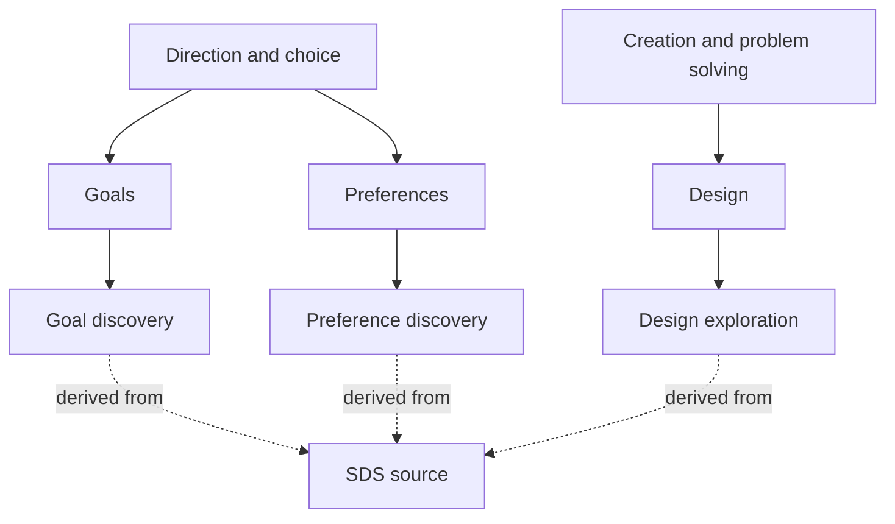

# Subject-centered organization

## Primary organization

The primary navigation opens functional groups, then subjects. Groups gather subjects by the kind of contribution they make. Within a subject are narrower questions, activities, and investigations, with systems developed specifically for their purposes. Source projects supply ancestors, mechanisms, examples, and evidence for those local systems.

The example shows two of the [eight working groups](subjects/README.md). Their subjects retain distinct local systems, with different objects, operations, outputs, and criteria. Their common source is lineage. A subject may need more than one local system from the same family, and a local system may combine several families. See [customization](CUSTOMIZATION.md).

## Functional grouping

A group states a common kind of work and explains each subject's contribution to it. Each subject has one main home, while explicit connections preserve its contributions elsewhere. This is an organizing relation; it does not mean that the subject is wholly reducible to its group's function or that the group must be completed before another can be entered.

Groups have different sizes because shared function determines membership. Their names and boundaries remain working choices. Promoting stays in an explicit holding area until its meaning supports placement. Connections and Improvement retain their proposed status. The [grouping decision](decisions/0004-functional-groups.md) records the criterion, difficult boundaries, and reasons to revise the arrangement.

## Distinctions the organization preserves

| Item | Example | Why it matters |
|---|---|---|
| Functional group | Direction and choice | A common kind of work that makes related subjects easier to find and develop |
| Subject | Preferences | What is being investigated |
| Account | A proposed conditional preference pattern | A claim about the subject |
| Method | Generating contrasting designs and obtaining selections | A way to investigate or work with it |
| Implementation | A program that executes part of a method | A particular realization with its own limits |
| Observation | The user selected System Kit from a batch | What occurred in a specified context |
| Inference | The user may favor a lower commitment about readiness | An interpretation requiring the appropriate status |
| Requirement | The new repository name should remain general and claim less | A condition for the current design task |
| Evidence of benefit | A retained comparison showing an improved result | A separate claim from the existence of the method |

These are useful distinctions, not an exhaustive schema into which every future object must fit.

## Relationships

Membership in a functional group, narrower subject, useful contribution, necessary prerequisite, sufficient condition, alternative route, support, contradiction, example, implementation, reference, and translation have different consequences. A shared word does not establish a relationship. A useful relation need not be a strict parent-child relation.

The previous placement map now records source relevance and pending custom development. Distinguish a subject owning a local design from that design deriving from a source, or consuming an observation shared with another design. A reference does not replace a local specification.

A connection can fail through mismatched meaning, scope, certainty, source status, or required inputs. Preserve a meaningful incompatibility instead of forcing every native object into a common representation.

## Native structures

The original sources retain their native identities and meanings. A local descendant can redesign QuestionRoute routes, GOSM gates, TruthFinder challenge procedures, or other native objects when its subject requires it. Record which distinctions are retained and which are deliberately changed. A source counterexample still targets its original claim, and an original observation does not acquire a new meaning merely because a descendant consumes it.

A local system can consume a native object, state what it uses, and preserve the conditions necessary to interpret that evidence. It must not equate a discovery's done status with universal truth, a predicted rating with a measured preference, or a source mention with a logical dependency.

## Physical layout

| Location | Role |
|---|---|
| subjects/README.md | Main index of functional groups |
| `subjects/<group>/README.md` | Shared function, member subjects, placement reasons, and connections |
| `subjects/<group>/<subject>/` | Subject development and its narrower inquiries |
| `subjects/<group>/<subject>/systems/` | Locally defined systems for particular purposes |
| subjects/unplaced/ | Visible holding area for unresolved placement; not a functional group |
| systems/ | Source-family profiles, initial relevance, and links to distinct descendants |
| cases/ | Consequential worked transitions serving several subjects |
| research/ | Cross-subject investigations and unresolved questions |
| decisions/ | Established direction and explicitly provisional choices |
| sources/ | Source identity, selected snapshots, and historical reviews |
| tools/ | Small checks supporting the documents |

The folders support the intellectual structure. They do not imply that all content has one exclusive location or that a new software platform is required. [Templates](templates/README.md) are optional starting aids. A concrete inquiry can justify a different representation.

## Change and continuation

When a finding changes a source interpretation, criterion, relation, or method, revisit the uses that depend on it. Preserve independent support and prior context. Byte changes and semantic changes are different; the local checker handles the former for preserved snapshots and does not discover the latter.

The groups, subjects, branch labels, and relationship names remain revisable. The architecture earns its place when it exposes a useful question, preserves a distinction, improves retrieval or continuation, or enables work that was previously missed.
