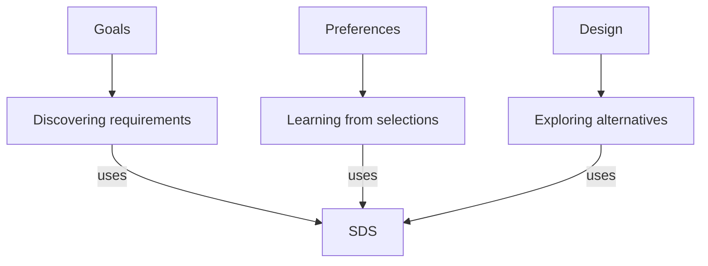

# Subject-centered organization

## Primary organization

The primary entry point is a subject. Below it are narrower questions, activities, distinctions, and investigations. A source system attaches where its contribution becomes definite. A subject can contain several competing accounts and several ways of doing the work.

These paths reference one SDS source. They supply different reasons for using it. A new method can enter any of these branches without becoming part of SDS.

## Distinctions the organization preserves

| Item | Example | Why it matters |
|---|---|---|
| Subject | Preferences | What is being investigated |
| Account | A proposed conditional preference pattern | A claim about the subject |
| Method | Generating contrasting designs and obtaining selections | A way to investigate or work with it |
| Implementation | A program that executes part of a method | A particular realization with its own limits |
| Observation | The user selected System Kit from a batch | What occurred in a specified context |
| Inference | The user may favor a lower commitment about readiness | An interpretation requiring the appropriate status |
| Requirement | The new repository name should remain general and claim less | A condition for the current design task |
| Evidence of benefit | A retained comparison showing an improved result | A separate claim from the existence of the method |

These are useful distinctions, not an exhaustive schema into which every future object must fit.

## Relationships

Narrower subject, useful contribution, necessary prerequisite, sufficient condition, alternative route, support, contradiction, example, implementation, reference, and translation have different consequences. A shared word does not establish a relationship. A useful relation need not be a strict parent-child relation.

Each proposed system placement records a specific branch where available. Broader candidate uses remain marked for branch development. Several parent views may refer to the same artifact. Keep canonical source identity and state what changes in the receiving inquiry when the contribution is used.

A connection can fail through mismatched meaning, scope, certainty, source status, or required inputs. Preserve a meaningful incompatibility instead of forcing every native object into a common representation.

## Native structures

QuestionRoute routes and chains remain routes and chains. GOSM goal journeys and decision forks retain their conditions and branches. TruthFinder counterexamples retain the exact claims they challenge. Historical AxiomNet formulas retain their assumption contexts. Discovery Engine references retain the identity and scope of the canonical discovery. Resource-engineering configurations and verdict histories retain their distinct roles.

An adapter can reference a native object, state what it consumes, and preserve necessary conditions. It must not equate a discovery's done status with universal truth, a predicted rating with a measured preference, or a source mention with a logical dependency.

## Physical layout

| Location | Role |
|---|---|
| subjects/ | Primary working hierarchies and subject-specific research |
| systems/ | Secondary profiles and reverse lookup of contributors |
| cases/ | Consequential worked transitions serving several subjects |
| research/ | Cross-subject investigations and unresolved questions |
| decisions/ | Established direction and explicitly provisional choices |
| sources/ | Source identity, selected snapshots, and historical reviews |
| tools/ | Small checks supporting the documents |

The folders support the intellectual structure. They do not imply that all content has one exclusive location or that a new software platform is required. [Templates](templates/README.md) are optional starting aids. A concrete inquiry can justify a different representation.

## Change and continuation

When a finding changes a source interpretation, criterion, relation, or method, revisit the uses that depend on it. Preserve independent support and prior context. Byte changes and semantic changes are different; the local checker handles the former for preserved snapshots and does not discover the latter.

The list of roots, branch labels, and relationship names remains revisable. The architecture earns its place when it exposes a useful question, preserves a distinction, improves retrieval or continuation, or enables work that was previously missed.
