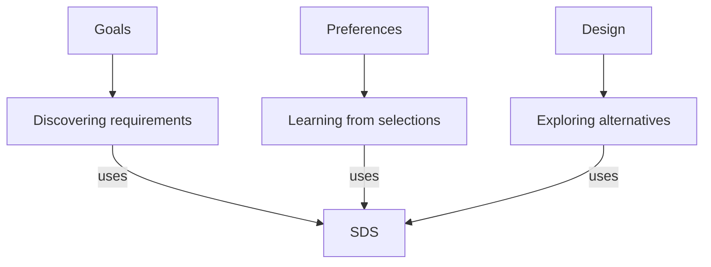

# Subjects as sciences: hierarchy and system placements

6 September 2026. Proposed organization following Ben Ward’s decision to make the subjects of relevance the top level. This document proposes an intellectual structure; it does not report repository migration, adoption of a name, or demonstrated perfection.

The subject determines the work. Existing systems contribute theories, questions, methods, implementations, examples, and evidence within that work. A subject remains open to approaches that none of the current systems contains.

There are 37 retained subjects from the preceding relevance map, plus two proposed additions, Connections and Improvement. These 39 subjects are peer entry points. Their overlaps are explicit relationships to investigate. They are not assigned to a single overriding subject in this proposal.

The subject hierarchy is a structure of narrower investigations. A contributing system attaches at the branch where its actual contribution becomes definite. Multiple placements reference the same source system and preserve the different roles it plays.

These are three contribution paths to one source system. The narrower subject branches supply different reasons for using it.

## 1. The six requested changes

| Previous entry | Proposed treatment | Concrete placement |
|---|---|---|
| Education | Remove as a top-level entry; retain useful work as an application. | Learning / changing another person’s understanding; Communication / explanation and practice. |
| Collaboration | Remove as a top-level entry; retain useful work as an application. | Action / action involving several actors; Goals / compatible and conflicting purposes; Communication / shared understanding. |
| Integration | Develop the broader subject Connections. Integration becomes one kind of work inside it. | Connections / identifying relations; Connections / composing systems; Connections / resolving incompatible interfaces. Representation also studies how those relations are expressed. |
| Evaluation | Distribute its distinct questions across existing subjects. | Judgment / assessment; Goals / criteria of success; Preferences / favoring; Truth / verification; Decisions / comparison before commitment. Measurement enters wherever an assessment needs an observable quantity. |
| Automation | Study how work is initiated, directed, continued, interrupted, and delegated. Record automatic execution as a property of particular methods. | Action / control and delegation; Intelligence / selecting work; Learning / changes in how work is performed. AutomaticScience remains a system available within Science. |
| Self-improvement | Develop the broader subject Improvement. Self-improvement is improvement whose object includes the agent or method doing the improving. | Improvement / finding and producing better alternatives; Improvement / improving methods of improvement. |

Connections includes relations that cannot be reduced to composition: contradiction, relevance, prerequisite, analogy, support, and temporal dependence. Improvement includes changes to tools, environments, representations, and institutions as well as changes to a thinker. Those distinctions justify the broader names.

Evaluation remains a useful operation name. A preference rating, an inference check, an outcome measurement, and a decision recommendation answer different questions; their common label should not erase those differences.

## 2. The complete first layer

The branches below are starting investigations, not a claim that each subject has already been exhaustively decomposed. Contributors identify inspected material or a clearly marked proposal. Their placement does not certify their effectiveness.

| Subject | First branches to develop | Existing contributions to place there | A concrete question about perfection |
|---|---|---|---|
| Reasoning | Available moves; implications; assumptions; alternatives; composition; choosing and changing an approach. | Reasoningtool procedures; Reasoningtool2’s operation work; ARAW; historical AxiomNet. | Given a situation, what makes a particular transition warranted, productive, and preferable to its available alternatives? |
| Prompting | Interpreting a request; specifying operations; choosing constraints; changing the model’s starting conditions; continuing an interaction. | Reasoningtool skill prompts; Superintelbot; recent anticipation and constraint experiments. | Which parts of the desired intellectual work can an instruction reliably determine, and which require subsequent judgment? |
| Promoting | Contribution; beneficiary; defensible claims; attention; encounter; adoption; continued use. | Reasoningtool communication and positioning procedures; Strategizer as a proposed source of contextual strategy. | Under what conditions does a presentation give the right people sufficient reason and opportunity to use something worthwhile? |
| Goals | Origin; formation; higher purposes; alternatives; conflicts; commitment; revision; achievement. | GOSM goal journeys; SDS requirements discovery; PreferenceFinder; Discovery Engine. | How can a goal be well chosen, and how does that differ from being fully achieved? |
| Preferences | Elicitation; concrete contrasts; context; conflicts; stability; change; predictive use. | SDS; PreferenceFinder; recorded judgments in resource-engineering. | What evidence distinguishes a durable preference from a reaction to this example in this context? |
| Values | Worth; importance; reasons for favoring; conflicting commitments; consequences; revision. | Relevant philosophy and regress material; goal journeys; preference contrasts. | What would justify a standard of worth when the candidate standards themselves disagree? |
| Intelligence | Available ability; usable ability; recognizing work; choosing methods; creating methods; adapting; learning. | Reasoningtool2; Superintelbot; BOD’s capability distinctions; resource-engineering; PostAGI reasoning material. | What prevents available capability from becoming competent behavior in a particular situation? |
| Discovery | Finding targets; creating possibilities; recognizing relevance; discovering distinctions; pursuing inquiries; checking findings; transferring findings. | Discovery Engine; ARAW; QuestionRoute; Reasoningtool; frame-changing experiments. | What makes a discoverable result become available, and which mechanisms systematically prevent that? |
| Curiosity | What attracts inquiry; unexplained interest; exploration; surprise; continuation; change of direction. | QuestionRoute; pure regress; Discovery Engine; incidental-exploration prompts. | When does following interest produce valuable discoveries that a specified objective would fail to select? |
| Questions | Formation; assumptions; answer spaces; composition; dependencies; routes; regress; selection; replacement. | QuestionRoute; pure regress; depth maps; question-generating skills. | What makes a question worth asking before its answer or eventual importance is known? |
| Search | Search targets; spaces; generation; retrieval; order; stopping; space revision. | Reasoningtool search procedures; Discovery Engine; System Recovery retrieval. | When is failure caused by search order, and when is the sought possibility absent from the representation being searched? |
| Understanding | Distinctions; relations; causes; mechanisms; contexts; alternative accounts; transfer. | LogicSystem decomposition; PostAGI representation families; philosophy corpora; Master Framework as a provisional contribution. | Which new inferences or interventions become possible when understanding improves? |
| Knowledge | Claims; support; scope; dependencies; contradictions; retention; correction; use. | Historical AxiomNet; LogicSystem; TruthFinder; System Recovery. | How can supported conclusions remain usable while their premises, meanings, or contexts change? |
| Truth | Claim content; grounds; inference; alternatives; counterexamples; scope; warranted conclusions. | TruthFinder; ARAW; LogicSystem; historical AxiomNet. | What establishes this exact claim, and which possible case would show the establishment was inadequate? |
| Uncertainty | Sources; distinctions among possibilities; representation; calibration; resolution; decisions under uncertainty. | QuestionRoute’s predicted-answer structures; ARAW alternatives; PreferenceFinder; relevant Reasoningtool procedures. | Which uncertainty is resolvable, what would resolve it, and what is the correct treatment of what remains? |
| Explanation | Explanatory target; contrast; causal structure; mechanism; abstraction; audience; competing explanations. | LogicSystem; BOD causal hypotheses; ARAW; Superintelbot. | What does an explanation account for that a description or restatement leaves unresolved? |
| Prediction | Target; conditions; competing predictions; consequences; observation; calibration; revision. | PreferenceFinder; QuestionRoute predicted answers; anticipation experiments; scenario procedures. | Does the prediction distinguish among plausible outcomes before the outcome is observed? |
| Learning | What changes; experience; updating; transfer; correction; persistence; learning methods. | PreferenceFinder feedback; GOSM outcome records; Reasoningtool2 correction rules; recent change-of-mind work. | Which change in later behavior is justified by this earlier result, and where does the change cease to apply? |
| Memory | Retention; identity; context; retrieval; reconstruction; updating; availability for use. | System Recovery; historical AxiomNet justifications; retained GOSM projects and failures. | Can earlier work be recovered with the distinctions and context needed for the present use? |
| Attention | Selection; allocation; focus; switching; persistence; interruption; missed significance. | Resource-engineering; BOD; GOSM’s choice of current work; Reasoningtool2. | Why was a consequential item overlooked despite being available? |
| Relevance | Contribution to a question; contribution to a goal; indirect contribution; context; visibility; mistaken exclusion. | System Recovery atlas; resource-engineering maps; Discovery Engine contribution placements; Reasoningtool2. | What specific difference does considering this item make to the inquiry or activity? |
| Representation | What is represented; distinctions exposed; distinctions hidden; transformation; preservation; multiple views. | Resource-engineering; PostAGI representation families; QuestionRoute’s native objects; historical AxiomNet. | Which transformation exposes a useful relation without silently losing a distinction needed later? |
| Creativity | Candidate generation; combination; departure; constraint variation; reframing; development; selection. | SDS; ARAW alternatives; Reasoningtool generation procedures; lists and “let’s say” experiments. | What produces materially different possibilities, and what merely redescribes the same possibility? |
| Design | Candidate forms; experience and selection; requirements; constraints; variation; feasibility; realization. | SDS; GOSM design projects; resource-engineering configurations; BOD realization work. | When must design precede the discovery of requirements, and how are the resulting requirements justified? |
| Problem finding | Undesirable conditions; unrealized possibilities; symptoms; causes; framing; priority. | BOD capability gaps; Reasoningtool2’s blockage distinctions; GOSM goal assessment. | Which formulation identifies something that changing would actually improve the situation? |
| Problem solving | Problem structure; causal accounts; candidate interventions; prerequisites; execution; feedback. | GOSM; ARAW; BOD; Reasoningtool procedures. | Does the intervention address the difficulty under the actual constraints, including causes missed by the original framing? |
| Judgment | What is being judged; applicable standards; comparison; evidence; conflicts; verdict; revision. | TruthFinder’s separate assessments; SDS selection; GOSM gates; resource-engineering verdicts. | Why does this criterion apply here, and what evidence would change the verdict? |
| Decisions | Alternatives; consequences; criteria; uncertainty; timing; commitment; reversal; revision. | GOSM decision forks; Strategizer; Reasoningtool decision procedures; PreferenceFinder as preference evidence. | What distinguishes the best available commitment from the best-looking argument for it? |
| Strategy | Context; actors; objectives; approaches; interactions; timing; counterplay; adaptation. | Strategizer; GOSM strategic work; ARAW consequences and alternatives. | Under which conditions does the approach succeed, and which response by another actor defeats it? |
| Planning | End states; reverse construction; forward consequences; prerequisites; alternatives; time; revision. | GOSM goal journeys and decision forks; QuestionRoute sequences; future-oriented procedures. | Which future conditions would invalidate the plan, and what remains reusable when that happens? |
| Action | Initiation; sequencing; persistence; control; interruption; completion; delegation; realization. | GOSM; BOD; Superintelbot work selection; resource-engineering. | What turns a valid intention into correctly ordered behavior that responds to reality? |
| Resources | Availability; possible uses; allocation; configurations; constraints; production; tradeoffs. | Resource-engineering; BOD; GOSM resource and feasibility work. | Which change in resources or their arrangement makes a previously unavailable result possible? |
| Research | Consequential unknowns; investigations; sources; methods; observations; synthesis; new directions. | QuestionRoute; ARAW; Discovery Engine; Autophilosophy; AutomaticScience planning material. | What work would discriminate among the live accounts or reveal a missing account? |
| Science | Concepts; models; hypotheses; evidence; experiments; explanation; discovery; correction; methods of science. | AutomaticScience; relevant Reasoningtool procedures; ARAW; Discovery Engine. | Which claims about the subject have been established, and which methods establish them under which conditions? |
| Philosophy | Concepts; assumptions; reasons; foundations; implications; disagreements; systematic alternatives. | Autophilosophy; pure regress; ARAW; LogicSystem; PostAGI corpora. | Which disagreement survives after its terms, dependencies, and competing implications are made explicit? |
| Writing | Intended contribution; intellectual operations; material; order; reader understanding; expression; revision. | Reasoningtool writing procedures; operation theory; Superintelbot; generated-book structures. | What does each part cause the reader to understand, consider, distinguish, or reconsider? |
| Communication | Participants; context; intended change; expression; interpretation; response; repair. | Superintelbot; conversational regress; anticipation; Reasoningtool communication procedures. | What contribution fits this interaction, and how can its interpretation change what should happen next? |
| Connections | Relation discovery; relation types; composition; incompatibility; dependency; indirect effects; changing relations. | Resource-engineering; QuestionRoute; AxiomNet; System Recovery; Master Framework as a provisional contribution. | Which relation exists, what does it permit, and what breaks when it is mistaken for another relation? |
| Improvement | What could be better; standards; alternatives; interventions; tradeoffs; demonstrated change; transfer; improving improvement. | GOSM outcome feedback; TruthFinder failure records; Reasoningtool2; SDS; System Recovery. | What became better, why, at what cost, and what supports expecting the improvement to recur? |

## 3. How the hierarchies acquire depth

The following paths are substantive investigations. An attached method is a contribution to that investigation. Its original sequence, assumptions, branches, and source identity remain recoverable.

### Goals

- **Where goals come from**
  - An existing desire, difficulty, curiosity, possibility, or obligation.
  - Goals inferred from patterns of choice: PreferenceFinder.
  - Goals revealed through encounters with concrete alternatives: SDS.
  - New aims made available by discoveries: Discovery Engine.
- **What a goal serves**
  - Immediate result and broader purpose.
  - Several purposes served by one activity.
  - A purpose that survives replacement of the original activity: GOSM goal journeys.
- **What counts as the goal being met**
  - Conditions necessary for the intended result.
  - Requirements learned from a selected design: SDS.
  - Outcome criteria and state judgments: GOSM.
- **How goals compete or change**
  - Conflicting aims, tradeoffs, and changing preferences.
  - A changed means, changed goal, and changed criterion as different events.
  - Evidence that reopens a commitment: Reasoningtool2 correction work.
- **How goals become achievable**
  - Missing capabilities and prerequisites: BOD and GOSM.
  - Resource configurations that create a feasible path: resource-engineering.

Open frontier: requirements extracted from a favorite design still require a distinction between an essential feature, a contextual preference, and an attractive incidental detail. Selecting the entire example does not determine that distinction by itself.

### Discovery

- **What becomes a possible object of discovery**
  - An explicitly unanswered question.
  - A distinction that makes a previously unformulated question possible.
  - A new goal, criterion, operation, representation, or connection.
  - A possibility exposed by changing a constraint: ARAW and constraint experiments.
- **Why a finding has not become available**
  - Relevant material absent, unfound, inaccessible, unrecognized, disconnected, wrongly represented, wrongly excluded, or unused: candidate distinctions from Reasoningtool2.
  - Several of those conditions in the same case.
  - A different explanation that the existing distinctions fail to capture.
- **What work can produce a finding**
  - Retrieval and recombination.
  - New observation or experiment.
  - Inference, counterexample, or alternative account: ARAW and TruthFinder.
  - Selection among concrete candidates: SDS.
  - Changing the frame through which the subject is examined: perspective experiments.
- **How discovery proceeds**
  - Contribution and prerequisite relationships: Discovery Engine.
  - Answer-conditioned continuations and composed inquiries: QuestionRoute.
  - A changed question, search space, or standard of success.
- **What a finding changes**
  - An answer, model, choice, capability, or future inquiry.
  - Previously separated work that becomes jointly useful: System Recovery.

Open frontier: a system can choose among existing questions while still lacking a method for discovering the question that would change the whole inquiry. Question selection and question invention need separate development.

### Reasoning

- **What can enter reasoning**
  - A claim, question, goal, observation, example, conflict, constraint, or incomplete idea.
  - The role each item currently plays.
- **What can be done with it**
  - Distinguish, combine, compare, infer, invert, generate, reformulate, or create another operation: Reasoningtool and Reasoningtool2.
  - Derive consequences under an assumption: ARAW’s assume-right work.
  - Find a state in which the assumption is false and develop its consequences: ARAW’s assume-wrong work.
- **What warrants a transition**
  - Formal support and assumptions: historical AxiomNet.
  - Evidence, scope, and targeted failure cases: TruthFinder and LogicSystem.
  - Productive exploration under a temporary assumption: “let’s say” and ARAW.
- **How one move changes the next**
  - A conclusion becomes a question.
  - A constraint becomes an object of investigation.
  - Several alternatives remain available: list-based exploration.
  - A criterion or method is replaced: change-of-mind and Reasoningtool2 work.
- **How the approach is chosen**
  - Anticipated contribution in this situation: anticipation and Superintelbot.
  - Dependencies, available means, and consequences: GOSM and resource-engineering.
  - Selection among existing operations and invention of a missing operation.

Open frontier: an operation’s written form leaves some choices to its executor. The science needs to determine which choices are specified, which remain, and which remaining choices require an additional operation or newly acquired understanding.

### Questions

- **What makes a question a question**
  - The uncertainty it expresses.
  - The assumed answer space.
  - Presuppositions that determine which answers are admitted.
- **How questions are formed**
  - A missing explanation, contradiction, new distinction, surprising implication, or possible improvement.
  - Candidate generation and question reformulation: Reasoningtool and pure regress.
- **How questions connect**
  - Clarification, opposition, analogy, prerequisite, implication, and other typed routes: QuestionRoute.
  - A contribution to another discovery: Discovery Engine.
  - Different relations between the same pair in different inquiries.
- **How questioning continues**
  - Answer-conditioned follow-ups.
  - Nested compound questions and reusable sequences: QuestionRoute.
  - Regress that opens new uncertainty.
  - Replacement of the inquiry’s starting assumptions.
- **How the next question is selected**
  - What its answers would change.
  - Which other questions it makes answerable.
  - Which possibilities it introduces that the current inquiry excludes.

Open frontier: a question can be useful through the possibilities it creates even when no immediate decision depends on its answer. An exclusively decision-based selection rule would omit this case.

### Intelligence

- **What ability is available**
  - Knowledge, methods, tools, access, resources, and embodied capabilities.
  - Described capability and realized capability: BOD.
- **What makes ability usable**
  - Finding it and recognizing its relevance: System Recovery and Reasoningtool2.
  - Representing and connecting it: resource-engineering and PostAGI work.
  - Choosing and correctly performing it: Reasoningtool2 and Superintelbot.
- **How an unfamiliar situation is handled**
  - Recognizing what kind of work is needed.
  - Forming an appropriate goal or inquiry.
  - Constructing a new approach from available means.
  - Discovering the missing means.
- **How competence persists through change**
  - Feedback, correction, and transfer: GOSM and PreferenceFinder.
  - Reconsidering an interpretation, goal, method, or criterion.
  - Initiation, persistence, interruption, and resumption: Action connects here.
- **How intelligence is understood and improved**
  - Distinguishing possession of a resource from its contribution to competent behavior.
  - Cases where more reasoning helps, wastes effort, or obstructs action.
  - Interactions among memory, attention, goals, discovery, and judgment.

Open frontier: a larger method library changes what is available. A theory of selecting and using the appropriate method must explain when that enlargement changes actual competence.

### Connections

- **What is connected**
  - Things, descriptions, claims, questions, operations, resources, goals, and results.
  - Several representations of one object and several distinct objects with similar descriptions.
- **What the relationship is**
  - Support, contradiction, prerequisite, alternative, analogy, composition, reference, causal influence, or contribution.
  - Exact formal justification: historical AxiomNet.
  - Typed question navigation: QuestionRoute.
  - Configuration relations and contrasts: resource-engineering.
- **What follows from the relationship**
  - A permissible inference.
  - A possible composition.
  - A changed priority or route.
  - A dependency that propagates a correction.
- **How connections are discovered and used**
  - Recovering context across separate bodies of work: System Recovery.
  - Making hidden relations visible through another representation.
  - Adapting incompatible meanings before composing systems.
- **How the organization itself changes**
  - A branch moves because its contribution is better understood.
  - One item gains a second justified placement.
  - A supposed relationship is removed after a counterexample.

Open frontier: “related to” does not determine whether one item is required, useful, sufficient, analogous, or merely mentioned. The science of Connections must account for those differences and their consequences.

## 4. Existing systems at specific branches

This is a proposed placement map based on inspected source descriptions and selected mechanisms. It is not an exhaustive classification of every repository file. Master Framework and Project Dashboard remain provisional placements because an exact defining artifact was not resolved in this review.

| System or source family | Specific placements | Contribution carried into the branch |
|---|---|---|
| Reasoningtool | Reasoning / operations / reusable procedures; Questions / formation / question-generating procedures; Writing / construction / writing procedures. | The actual procedures, invocation relationships, and examples. Individual procedures receive their own additional placements. |
| Reasoningtool2 | Reasoning / choosing and composing operations; Intelligence / making available capability usable; Improvement / correcting methods; Prompting / specifying intellectual work. | Current open-operation contract, distinctions among failures of availability and use, correction rules, and the recent operation research. |
| Master Framework — provisional | Understanding / common structure across subjects; Connections / relationships among activities; Representation / organizing a body of understanding. | A proposed account of how the subjects and their methods relate. Its exact source and claims still need to be attached. |
| Discovery Engine | Discovery / organizing and pursuing discoveries; Questions / relationships among inquiries; Relevance / contribution to further discovery. | The native discovery hierarchy, scope-relative status, contribution placements, references, and ways of continuing discovery. |
| SDS | Design / exploring and refining alternatives; Preferences / discovery through selection; Goals / discovering requirements from examples. | Diverse designs, selected examples and aspects, iterations, derived requirements, and feasibility assessment. |
| QuestionRoute | Questions / typed navigation; Questions / composed inquiries; Research / inquiry sequences; Prediction / predicted answers and follow-ups. | Atomic questions, route meanings, sequences, nested chains, regress structures, and user journeys. |
| GOSM | Goals / purpose and goal journeys; Planning / prerequisites and decision forks; Action / state-dependent work; Improvement / outcome feedback. | Goal relationships, gates, repair procedures, project artifacts, decisions, state, and measured outcomes where available. |
| ARAW | Reasoning / conditional implications; Truth / testing assumptions; Discovery / generating alternative accounts; Strategy / consequences of possible approaches. | Exact claims, conditional contexts, constructive consequences, wrongness cases, alternatives, recursion, and unresolved tensions. |
| Historical AxiomNet | Reasoning / formal support; Knowledge / context and justification; Connections / support and conflict. | Formula structure, assumptions, canonical identity rules, justifications, and derivation traces. |
| LogicSystem | Understanding / functional and causal decomposition; Truth / scope and modal claims; Knowledge / claim relationships; Judgment / distinct assessments. | Its separate native tools and claim structures, including their known unfinished or inconsistent parts. |
| TruthFinder | Truth / targeted error discovery; Judgment / belief and decision assessments; Improvement / learning from specific failures. | Argument blueprints, targeted error vectors, counterexamples, and retained failure reports. |
| PreferenceFinder | Preferences / conditional patterns; Prediction / anticipated reactions; Learning / updating a preference model. | Observations, hypotheses, questions, predicted ratings, actual feedback, and exceptions. |
| Strategizer, including the current AxiomNet naming transition | Strategy / approaches and counterplay; Decisions / context-sensitive selection; Planning / testing entry conditions. | Game contexts, strategy families, variants, preconditions, counterstrategies, and provenance. |
| Superintelbot | Communication / choosing a contribution; Intelligence / selecting appropriate work; Prompting / instructions governing interaction. | The conversational system, mixed interaction dimensions, consultation practices, and response repertoires. |
| PostAGI reasoning | Representation / alternative forms of intellectual work; Questions / depth and regress; Understanding / interacting concepts; Communication / concepts in conversation. | Its distinct representation families and corpora. Concept hubs, dependency maps, conversational moves, and continuous regress remain distinct. |
| Autophilosophy | Philosophy / systematic investigations; Research / examining and attacking accounts; Knowledge / retaining philosophical work. | The actual concept investigations, proposed procedures, and worked answer–attack–revision artifacts. |
| AutomaticScience | Science / methods and organization of inquiry; Questions / structured self-investigation; Writing / construction of inquiry books. | Project plans and the distributed book family. The name’s ambition is kept separate from demonstrated scientific discovery. |
| Resource-engineering | Resources / allocation and configurations; Connections / typed relationships; Representation / perspectives and transformations; Reasoning / operations on represented material. | Ontology, configurations, operations, maps, contrasts, and verdict history. Rejected conclusions retain their historical status. |
| BOD | Action / capability realization; Resources / capability conditions; Explanation / causal hypotheses; Problem finding / gaps between possible and realized capability. | Context, components, capability distinctions, competing causal accounts, and realization conditions. |
| System Recovery | Memory / recovering earlier work; Knowledge / preserving source and history; Relevance / recognizing useful material; Connections / cross-system composition. | Recovered sources, native structures, source-linked relationships, checks, and worked recovery cases. |
| Project Dashboard — provisional | Planning / seeing project state; Attention / choosing current work; Action / monitoring progress. | Candidate placement inferred from the name and its place in the portfolio. Exact source behavior has not been inspected here. |

A source system can contribute to the study of a subject, exemplify an activity within it, and implement a method for it. These are different roles. ARAW is itself an example of reasoning and also a method available for investigating claims in other subjects. A failure of ARAW can become evidence within Reasoning or Improvement without becoming an endorsed method.

The system’s native structure is preserved behind these placements. A QuestionRoute chain remains a chain. A GOSM decision fork remains a fork. A TruthFinder counterexample remains attached to the claim it challenges. A discovery reference remains a reference to the same discovery.

## 5. Recent discoveries and experiments also receive homes

The following material comes from the conversation program. These are proposed placements of techniques and hypotheses, not claims of experimentally established general effects.

| Work | Specific placements | Question developed by the placement |
|---|---|---|
| Anticipating a response before producing it | Prediction / anticipated continuation; Communication / choosing a contribution; Reasoning / selecting the next move. | Which change comes from forecasting an exchange, which from choosing an intended contribution, and which from their interaction? |
| Outcome framing | Communication / intended change in understanding; Goals / purpose of a contribution; Writing / arranging intellectual work. | How does a contribution’s intended effect determine what belongs in it? |
| Theory of operations | Reasoning / transformations; Prompting / specifying operations; Writing / operations performed by prose. | What must be transformed for this particular result to become available? |
| Theory of perspectives | Representation / changing frames; Understanding / what a frame exposes; Discovery / discovering through another frame. | Which new operation, question, or relation becomes available after the frame changes? |
| Changing one’s mind | Judgment / revising a position; Decisions / reopening a commitment; Learning / changing future behavior. | What exactly changes: conclusion, interpretation, standard, goal, method, or confidence? |
| Pure regress | Questions / recursive questioning; Philosophy / foundations; Discovery / exposing unanswered dependencies. | At which transition does a new question introduce uncertainty that the previous question did not contain? |
| Lists | Creativity / preserving alternatives; Reasoning / maintaining several live possibilities; Decisions / candidate sets. | What becomes possible when alternatives coexist before one is selected? |
| “Let’s say” | Reasoning / temporary assumptions; Creativity / possibility construction; Planning / conditional futures. | What follows when an ordinarily distant possibility becomes a starting condition? |
| “Exclude its own continuation” | Prompting / exclusion constraints; Creativity / forcing a different candidate; Reasoning / changing the available next moves. | What distinguishes a substantive departure from a superficial change that preserves the same continuation? |
| Try without committing; follow something incidental | Discovery / exploratory departures; Curiosity / following interest; Strategy / reversible probes. | Which discoveries become available without first establishing that the current direction is defective? |
| Locations where results fail to become available | Intelligence / usable capability; Discovery / unavailable findings; Problem solving / competing diagnoses. | Which distinction selects a different useful operation in an actual case? |
| Long goal journeys and future extrapolation | Goals / purposes across time; Planning / reverse and forward construction; Prediction / conditional trajectories. | Which commitments survive across several plausible futures, and which depend on one particular forecast? |

## 6. What a developed science contains

Each subject develops its own distinctions and dependencies. The following kinds of work recur, but their order is determined by the particular investigation.

1. **The subject itself.** What occurs, what varies, which distinctions matter, and what examples or counterexamples reveal.
2. **Accounts of the subject.** Definitions, models, explanations, derived relationships, competing theories, and explicit unresolved claims.
3. **Ways of investigating it.** Questions, observations, comparisons, experiments, derivations, and methods for finding what the present account omits.
4. **Ways of doing or improving it.** Concrete operations, procedures, tools, systems, and conditions of successful application.
5. **Evidence of what works.** Worked cases, outcomes, failure cases, proofs where appropriate, and limits of generalization.
6. **Its unresolved frontier.** Questions and missing distinctions whose answers would change the theory, practice, or organization.

For example, under Preferences, SDS is a method for generating and selecting examples; a person’s repeated selections are observations; a proposed stable preference is a hypothesis; a later contrary choice challenges that hypothesis; the person’s actual preferences are the subject being investigated. Putting all five under the name of the SDS repository would hide those relationships.

A hierarchy establishes more understanding when a branch changes which question can be asked, what can be inferred, or which operation becomes appropriate. A renamed folder alone does not establish that change.

## 7. Developing perfection within the hierarchy

Perfection concerns an exact activity, property, or account. Perfection of a theory of goals, perfection of goal formation, and perfect achievement of a chosen goal are three different claims.

For a branch to establish a perfection claim, the claim must identify the cases it covers, the available means and constraints, and the relevant standard. Proof of optimality in a specified class, absence of observed failures, and a method that keeps improving have different strengths. The hierarchy retains those distinctions.

| Branch | A strong target | A defect that defeats that target |
|---|---|---|
| Goals / formation | A goal-selection process that accounts for the purposes and alternatives consequential to the choice. | An omitted alternative serves the accepted purposes better under the same relevant constraints. |
| Goals / achievement | All necessary conditions of the intended outcome are actually met. | A polished artifact passes review while a necessary outcome condition remains false. |
| Reasoning / a specified inference | The conclusion follows from the stated premises under the stated interpretation. | A case satisfies the premises and falsifies the conclusion. |
| Reasoning / method choice | The selected approach is justified relative to the live alternatives and the actual intellectual work. | The choice rests on an irrelevant criterion or misses an available approach whose decisive advantage is established. |
| Discovery / a bounded space | Every result meeting the declared discovery criterion in the specified space is found. | A qualifying result is omitted. |
| Discovery / forming the space | The representation can be revised when a useful possibility falls outside its current distinctions. | A candidate is excluded solely because the present categories cannot express it. |
| Questions / a route | The route preserves the consequential distinctions among possible answers and continuations. | Two answers that require different next investigations are forced into the same continuation. |
| Uncertainty / representation | Claims express the uncertainty supported by the available grounds. | Unresolved alternatives are represented as a settled answer, or decisive evidence is represented as unresolved. |
| Memory / recovery for a task | Needed earlier material can be reconstructed with its identity, scope, and consequential context intact. | The text is recovered but its rejected status or conditional assumption is lost. |
| Design / requirements discovery | The selected features and the requirements inferred from them are distinguished and justified. | Liking an incidental feature becomes an asserted universal requirement. |
| Connections / dependency | A dependency’s meaning and consequences hold in its stated context. | A merely helpful route is treated as a necessary prerequisite. |
| Improvement / demonstrated change | The relevant result improves under a justified comparison and the cost or tradeoff is represented. | Only the score improves, while the activity the score was supposed to track gets worse. |

Strong ideals remain available beyond bounded cases. A universal claim requires a universal argument or an adequate characterization of its domain; a finite set of successful examples does not establish one. A tradeoff between two goals belongs in the account of perfection instead of disappearing inside a single score.

Three further branches follow from the current program:

- **Standards can be discovered.** A design or explanation can reveal a quality the original evaluation never considered. The science of Judgment therefore includes discovery and revision of criteria.
- **Methods can become objects of inquiry.** ARAW, SDS, anticipation, and the master framework can each be investigated, compared, improved, or replaced within the subjects they serve.
- **The organization can be improved.** A subject hierarchy that hides a useful connection contains a defect in representation. Representation and Connections can study and correct that defect.

## 8. Names for the repository and active system

The candidates below are conceptual naming proposals. No repository has been created or renamed.

| Name | What it literally emphasizes | What the name leaves less explicit |
|---|---|---|
| **Science Engine** | A working system for developing these subjects into increasingly complete sciences. | The retained body of understanding, beyond the process that develops it. |
| **General Science** | An organized program of systematic investigation across the subjects. | Its active tools and practical execution. |
| **Intelligence Science** | Understanding and improving the capacities through which inquiry and action become competent. | Subjects pursued for their own sake, beyond their contribution to intelligence. |
| **Intelligence Engineering** | Constructing and improving the means of intelligent activity. | The foundational investigations that precede a known practical application. |
| **Systematic Understanding** | A connected and carefully developed understanding of the subjects. | Creation, intervention, and accomplishment. |
| **Reasoning Science** | Developing reasoning itself into a deeply understood and improvable discipline. | The peer status of goals, resources, action, and the other subjects. |

Science Engine is the leading candidate for the active system that develops the subjects. General Science is the leading candidate for the repository conceived as the body of developed subjects. Intelligence Science fits a more specific commitment to understanding and improving intelligent activity.

Reasoning Tool remains a useful name for an instrument that contributes within the new organization. The same relation preserves Discovery Engine, SDS, and QuestionRoute as identifiable systems while their contributions become accessible through the relevant subjects.

A regular naming family is also available: Science of Reasoning, Science of Goals, Science of Discovery, Science of Questions, and so forth. These can be page titles inside one repository. Their existence does not require a separate repository for every subject.

## 9. The first substantive development work

The next work can develop actual branches while the rest remain visible.

1. **Relevance / placement of a contribution.** For the same recovered item, establish several exact uses, the branch each use serves, and the consequence of leaving it out. SDS is the first worked case: design alternatives, preference evidence, and goal requirements.
2. **Goals / requirements discovered through examples.** Reconstruct an actual selection episode. Separate the selected example, selected aspect, inferred preference, and candidate requirement. Compare that result with direct requirements elicitation on the same task.
3. **Questions / discovering the next inquiry.** Take a case with several plausible questions and develop the consequences of answering each. Retain a route that changes when an answer changes, and investigate whether an unlisted question improves it.
4. **Reasoning / choosing and composing operations.** Take a substantive unresolved claim or design problem. Compare ARAW, a frame change, retrieval, and a new observation where they genuinely compete. Develop the actual missing result, then retain the operation sequence and its consequences.
5. **Judgment / standards revealed by the work.** Record a case where an initial criterion excludes a useful result. Derive the replacement criterion from the case and test it against an opposing example.
6. **Connections / relations between these branches.** Preserve the specific finding passed between branches and what the receiving branch changes because of it. A connection is developed through its effect on another inquiry.

These are proposed investigations, not scheduled automations. Their outputs populate the sciences with distinctions, accounts, methods, and evidence. The root map remains available for adding branches whenever an actual inquiry requires them.

## 10. Placement checks and unresolved boundaries

The proposed map classifies 21 source families and 12 recent lines of work. Its systematic distinctions come from comparing concrete cases, examining the source systems’ native structures, and varying the role an item plays while holding the item itself constant.

| Distinction | Concrete comparison | Consequence for the hierarchy |
|---|---|---|
| Subject and contributor | Discovery as an activity versus Discovery Engine as a particular system. | The subject has room for theories and methods beyond the present implementation. |
| Topic and role | ARAW reasoning about a preference versus a PreferenceFinder observation about that preference. | Both concern Preferences; one supplies a method and the other supplies evidence. |
| Object and property | A goal being well chosen versus that goal being achieved. | Goal formation and goal achievement need distinct standards. |
| System and constituent | The whole QuestionRoute system versus one answer-conditioned regress. | Individual contributions can be placed precisely while the native system remains intact. |
| Availability and effectiveness | A written SDS loop versus its successful use in a real design episode. | The method’s existence and its demonstrated effects have separate records. |
| Context of use | SDS used for choosing a visual form versus selecting an explanation style. | The same operation can serve different subjects and requires context-sensitive evidence. |
| External application and self-application | Improving a design versus improving SDS itself. | Self-improvement is a case of Improvement; it does not need a separate root. |
| Arrangement and consequence | A source is linked under a subject versus that source changing an inquiry there. | Placement is supported by a specific contribution, not merely a shared word. |

These distinctions vary independently in the inspected examples: the same SDS method has several subject placements; different artifacts within QuestionRoute occupy different roles within Questions; an identical procedure can exist before and after evidence of effectiveness is acquired; and an improvement method can change its object from a design to itself. They are not a finite Cartesian enumeration of the intellectual domain. The numbers of possible subjects, contexts, methods, and findings remain open.

Known boundary cases remain visible:

- Master Framework and Project Dashboard need exact source artifacts before their proposed roles can become source-grounded placements.
- Current and historical AxiomNet have different identities and must keep their version contexts.
- AutomaticScience is distributed across repositories; repository location cannot determine subject membership.
- The recent anticipation and perspective work supplies questions, techniques, and hypotheses. It should not enter as an already complete theory.
- Education and Collaboration remain accessible as applications without becoming roots again.
- The 39 roots are the current accepted starting set plus two proposals. A substantive unclassifiable case can justify a new root or a revised relationship; absence from the list does not establish irrelevance.

## Source basis

- [System Recovery cross-system relations, inspected snapshot](https://github.com/benjam3n/systemrecovery/blob/d71a8430452fb8563d722c5df3b904bb7109197e/structure/CROSS-SYSTEM-RELATIONS.md).
- [System Recovery atlas, inspected snapshot](https://github.com/benjam3n/systemrecovery/blob/d71a8430452fb8563d722c5df3b904bb7109197e/ATLAS.md).
- [PostAGI representation profile, inspected snapshot](https://github.com/benjam3n/systemrecovery/blob/d71a8430452fb8563d722c5df3b904bb7109197e/structure/profiles/postagi-reasoning.md).
- [Reasoningtool2 current working contract, inspected snapshot](https://github.com/benjam3n/reasoningtool2/blob/ae2435b0004ac44de9bb09c2f045805722038dbb/CURRENT.md).
- [SDS README, reread during this proposal](https://github.com/benjam3n/sds/blob/main/README.md).
- [Discovery Engine README, reread during this proposal](https://github.com/benjam3n/discoveryengine/blob/main/README.md).
- The visible conversation establishes the subject list, the top-level inversion, the six requested changes, and the proposed pursuit of perfection. The proposed branch labels, placements, perfection criteria, and names in this document are new contributions to that discussion.

Version 0.1. Initial proposal; no migration performed.
